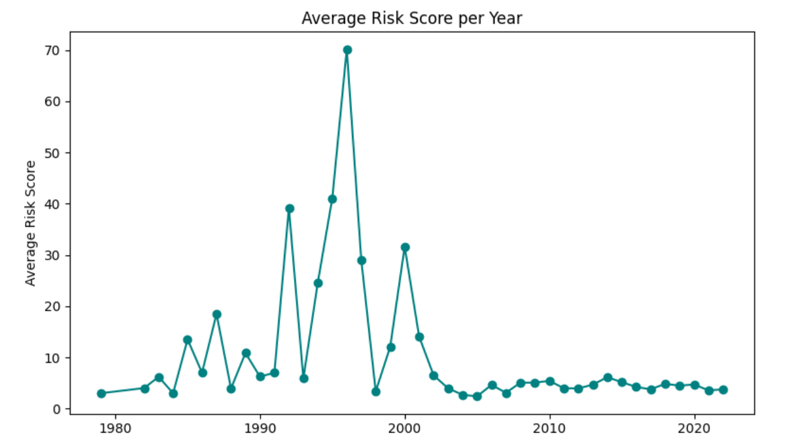
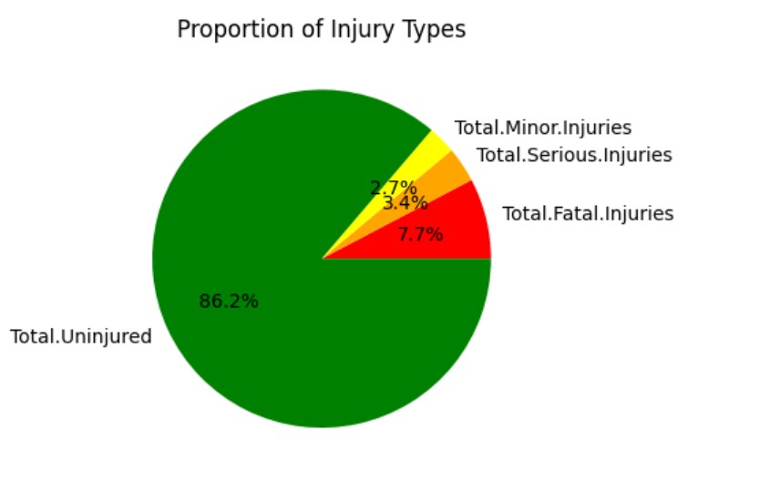
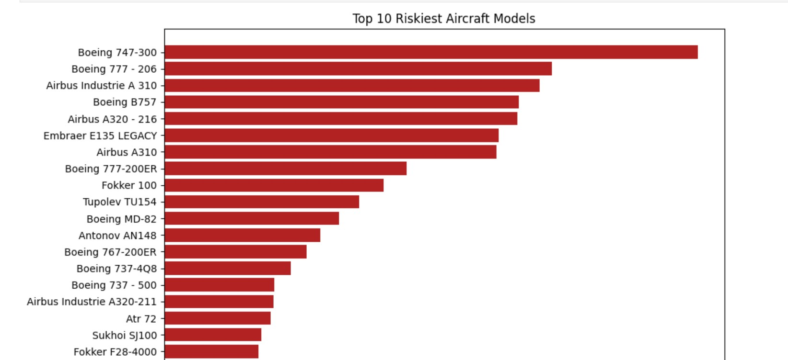

# Phase_1_Project
# Aviation Data Analysis Project
## Overview
This project analyzes aviation accident and incident data to identify aircraft models with the lowest risk profiles, supporting a company's strategic entry into the aviation industry. By leveraging data from the Aviation_Data.csv dataset, we aim to provide data-driven recommendations for purchasing aircraft with optimal safety records for both commercial and private operations. The analysis is conducted using a Jupyter Notebook `(Aviation_Data_Analysis.ipynb)`, utilizing Python libraries such as `pandas, NumPy, matplotlib,` and `seaborn` for data manipulation, analysis, and visualization.

## Business Understanding
Stakeholder: The head of the new aviation division of a company expanding its portfolio into the aviation industry.

### Key Business Questions:

### Which aircraft models and makes exhibit the lowest risk based on historical accident and incident data?
### What are the key risk factors (e.g., injury severity, aircraft damage, weather conditions) associated with aviation incidents?
### How can the company prioritize aircraft purchases to minimize operational risks and ensure safety?

The objective is to guide the stakeholder in making informed purchasing decisions by identifying aircraft with the best safety records, thereby reducing operational risks and ensuring a successful entry into the aviation market.

## Data Understanding and Analysis
### Source of Data

The dataset, `Aviation_Data.csv`, contains detailed records of aviation accidents and incidents, sourced from a comprehensive aviation database, NTSB. It includes information on event details, aircraft characteristics, injury outcomes, and environmental conditions.

### Description of Data
The dataset comprises 90,348 entries with 31 columns, reduced to 32,287 entries after filtering for non-null Aircraft.Category values. Key columns include:

Event.Id: Unique identifier for each event.
Event.Date: Date of the incident (converted to datetime).
Aircraft.Category: Type of aircraft (e.g., airplane, helicopter).
Make and Model: Aircraft manufacturer and model.
Injury.Severity: Severity of injuries (e.g., Fatal, Non-Fatal).
Aircraft.damage: Extent of damage (e.g., Destroyed, Substantial).
Total.Fatal.Injuries, Total.Serious.Injuries, Total.Minor.Injuries, Total.Uninjured: Counts of respective outcomes.
Weather.Condition: Weather during the incident (e.g., VMC, IMC).

Data cleaning involved dropping columns with high missing values (e.g., Broad.phase.of.flight, Schedule, Air.carrier) and irrelevant columns (e.g., Investigation.Type, Accident.Number). Missing values in critical columns will be handled in further analysis (e.g., filling with mean/median/mode or imputation).

### Visualizations

Trend of Aviation Risk Score Over Time. 
This line plot illustrates the risk score per year, derived from the Event.Date column. It helps identify temporal trends in incident frequency, which is crucial for understanding historical safety patterns.

Injury Severity by Airplanes.
A pie chart showing the distribution of injury severity (e.g., Fatal, Serious, Minor, Uninjured) across airplanes' accidents. 

Risk Score by Make and Model.
A bar plot displaying the extent of risk score for top airplanes. This helps identify manufacturers with lower risk rates, indicating safer aircraft models.

## Conclusion
The preliminary findings suggest:

#### Temporal Trends: 
The line plot of incidents over time indicates fluctuations in incident frequency, which may correlate with advancements in aviation technology or regulatory changes. Further analysis will quantify these trends.
#### Data Quality:
The dataset has significant missing values in columns like Broad.phase.of.flight (77.15% missing) and Schedule (89.20% missing), justifying their removal. Critical columns like Make, Model, and Injury.Severity have minimal missing data, making them reliable for risk assessment.
#### Focus on Aircraft Category: 
By filtering for non-null Aircraft.Category, the dataset is narrowed to 32,287 entries, ensuring relevance to the business objective of identifying low-risk aircraft for purchase.

Future steps include completing the data cleaning process (e.g., handling missing values in Number.of.Engines, Engine.Type), generating the planned visualizations, and calculating risk metrics (e.g., incident rates, fatality rates) per aircraft make and model. These insights will drive recommendations for aircraft with the lowest risk profiles, aligning with the company's goal of safe and efficient operations.